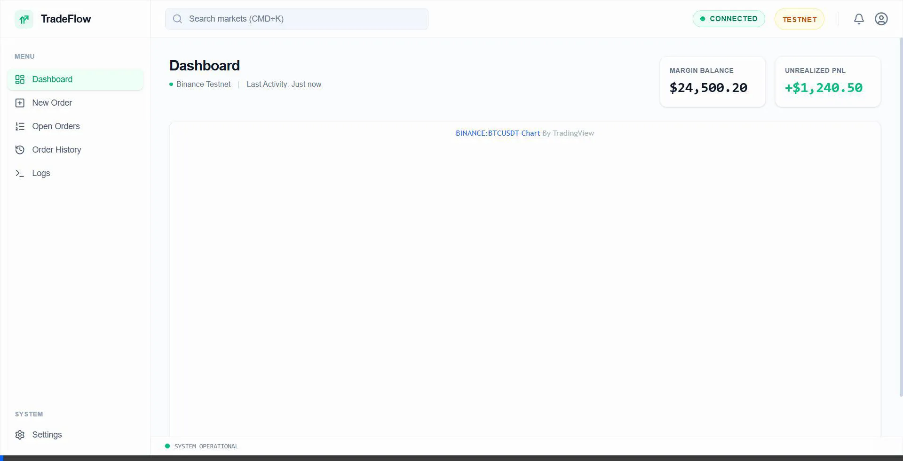
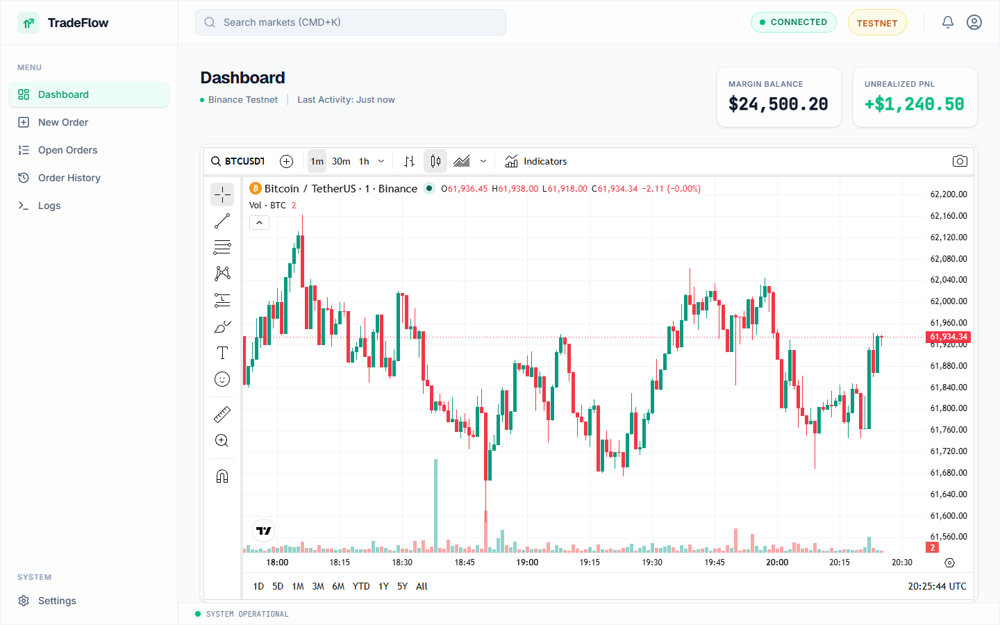
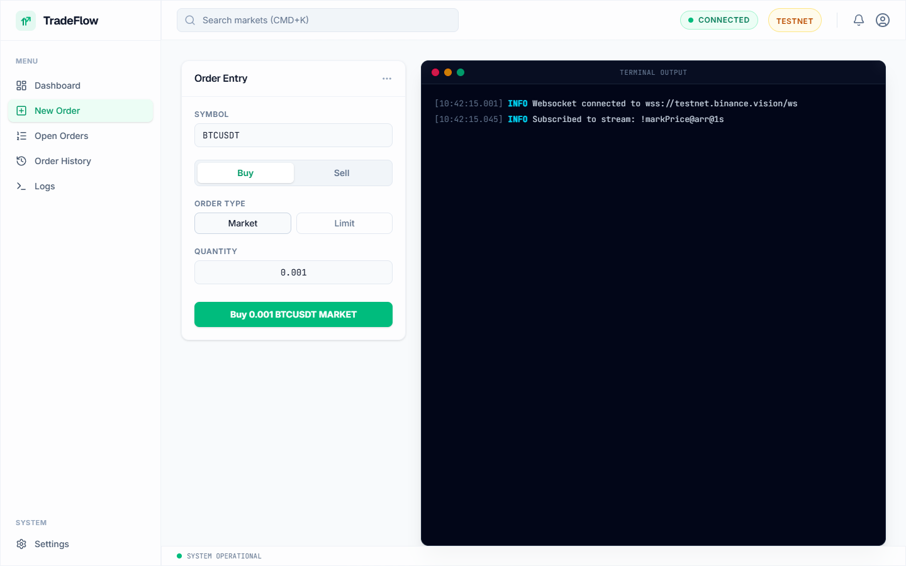
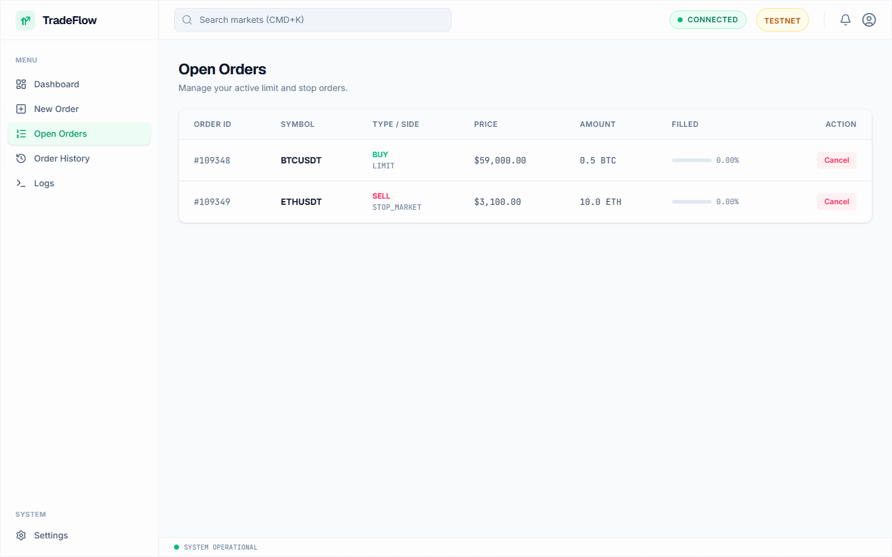
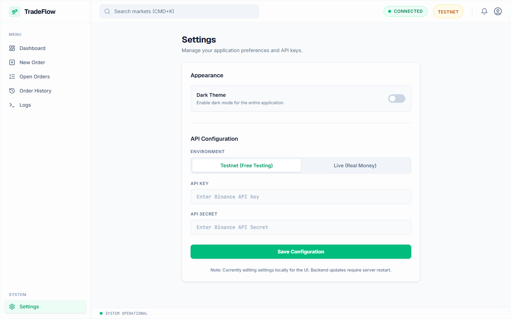

<div align="center">
  
  <h1 align="center">TradeFlow Web Terminal</h1>
  <p align="center">
    <strong>A high-performance, SaaS-grade graphical trading terminal for Binance Futures.</strong>
  </p>
  <p align="center">
    
    
    
    
  </p>
  <p align="center">
    <a href="#overview">Overview</a> •
    <a href="#problem-being-solved">Problem Solved</a> •
    <a href="#features">Features</a> •
    <a href="#demo-walkthrough">Demo</a> •
    <a href="#screenshots">Screenshots</a> •
    <a href="#tech-stack">Tech Stack</a>
  </p>
</div>

---

## ⚡ Overview

TradeFlow Web Terminal is a pristine, full-stack trading application built to securely interface with Binance Futures. Designed with an ultra-premium SaaS aesthetic, it abstracts the complexities of quantitative algorithmic trading into a responsive, intuitive, and highly visual dashboard, empowering traders to monitor the market and execute logic without touching a command line.

**Note:** This `webapp` branch contains the full React graphical interface. If you are looking for the highly optimized, headless Python execution engine, switch to the **`main`** branch.

## 🎯 Problem Being Solved

Default exchange interfaces are often cluttered, slow, and overly rigid, making it difficult for developers and algorithmic traders to safely test their strategies on testnets. **TradeFlow solves this** by providing a decoupled, custom control center. It offers real-time TradingView charts, a beautifully logged mock-terminal, and an intelligent "Paper Trading Fallback" mechanism that allows UI workflows to continue seamlessly even if the exchange API temporarily rejects testnet credentials.

## ✨ Features

- **Real-Time Interactive Charting**: Deep integration with `react-ts-tradingview-widgets` to provide high-fidelity market data visualization directly within the dashboard.
- **Order Execution Engine**: Secure, RESTful proxy backend capable of firing Market, Limit, and Stop orders via the Binance API.
- **Intelligent Simulation Fallback**: If Binance API keys expire (common on Testnets), the Python backend intercepts the `401 Unauthorized` errors and generates a clean, simulated execution payload so front-end testing is never interrupted.
- **Live System Telemetry**: A macOS-styled terminal emulator built in React, streaming real-time operational logs directly to the browser.
- **Glassmorphic UI Engine**: Bleeding-edge design utilizing Tailwind CSS V4 for a pristine, responsive, and perfectly synced Dark/Light mode experience that extends directly into the TradingView iframes.

## 🎥 Demo Walkthrough

<div align="center">
  
  <p><em>End-to-end walkthrough demonstrating Dashboard loading, Theme Toggling, and Simulated Order Execution.</em></p>
</div>

## 📸 Screenshots

| Real-Time Dashboard | Order Execution Panel |
| :---: | :---: |
|  |  |

| Open Orders (Empty State) | Application Settings |
| :---: | :---: |
|  |  |

## 💻 Tech Stack

### Frontend Architecture
- **Framework**: React 18 (TypeScript) via Vite for lightning-fast HMR.
- **Styling**: Tailwind CSS V4, utilizing raw utility classes (`glass-panel`) for a modern, glassmorphic SaaS aesthetic.
- **Routing**: React Router DOM v6.
- **Icons**: Lucide React.

### Backend Proxy
- **Framework**: FastAPI (Python).
- **Exchange Integration**: `python-binance`.
- **Security**: Environment-driven credential management (`python-dotenv`).

## 🚀 Installation & Running Locally

### Prerequisites
- Node.js (v20+)
- Python 3.9+

### 1. Start the Backend Proxy
```bash
git clone https://github.com/ManoharTej/trading-bot.git
cd trading-bot
git checkout webapp

# Install Python requirements
pip install -r requirements.txt

# Configure environment keys
cp .env.example .env

# Start FastAPI server
python api.py
```
*The FastAPI server will start on `http://127.0.0.1:8000`*

### 2. Start the Frontend Application
```bash
# Open a new terminal
cd frontend

# Install Node dependencies
npm install

# Start Vite Dev Server
npm run dev
```
*The Application will be live at `http://localhost:5173`*

## 🔮 Roadmap & Future Enhancements
- **WebSocket Price Feeds**: Replace REST polling with raw WebSocket connections for sub-millisecond order book updates in the UI.
- **Portfolio Analytics**: Implement a local SQLite database to chart Profit/Loss curves over time based on historical trade execution.
- **Algorithmic Strategy Toggles**: Add UI switches to turn specific headless Python scripts (running in the backend) on and off dynamically.

---
*Developed and maintained by Manohar Tej. Engineered for scale and aesthetics.*
