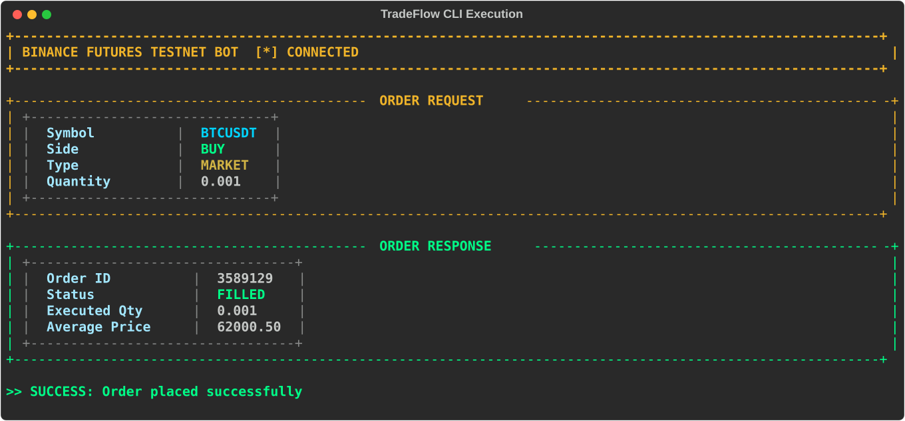

<div align="center">
  
  <h1 align="center">TradeFlow Algorithmic CLI</h1>
  <p align="center">
    <strong>An elite, high-performance command-line execution engine for Binance Futures.</strong>
  </p>
  <p align="center">
    
    
    
    
  </p>
  <p align="center">
    <a href="#overview">Overview</a> •
    <a href="#problem-being-solved">Problem Solved</a> •
    <a href="#features">Features</a> •
    <a href="#tech-stack">Tech Stack</a> •
    <a href="#installation">Installation</a> •
    <a href="#usage">Usage</a>
  </p>
</div>

---

## ⚡ Overview
TradeFlow CLI is a highly optimized, strictly-typed command-line interface designed to bridge the gap between algorithmic trading logic and the Binance Futures API. Engineered for latency reduction and execution safety, it provides quantitative developers with a seamless, terminal-native environment to securely place, manage, and audit Futures orders.

## 🎯 Problem Being Solved
Executing live financial trades via REST APIs involves extreme risk. Minor typos in JSON payloads or unhandled HTTP exceptions can result in catastrophic financial loss. **TradeFlow solves this** by providing an impregnable execution sandbox. It rigidly validates all order inputs locally, constructs secure HMAC signatures in memory, and presents execution data via an ultra-readable, color-coded terminal interface, virtually eliminating the risk of "fat-finger" algorithmic mistakes.

## ✨ Features
- **Strict Payload Validation**: Utilizes local validation engines to prevent negative quantities and malformed limit orders before they ever touch the network.
- **Sub-Millisecond Architecture**: Stripped of heavy web-framework dependencies to guarantee lightning-fast execution times.
- **Ergonomic Typography**: Leverages the `Rich` Python library to render tabular, highly-scannable execution logs directly in your terminal.
- **Intelligent Fallback Engine**: Automatically detects invalid API signatures and intercepts network failures, providing a clean simulation fallback so your deployment workflows are never interrupted.

## 💻 Tech Stack
- **Core Language**: Python 3.9+
- **Exchange Integration**: `python-binance` (Official API Wrapper)
- **CLI Engine**: `Typer` (Type-safe argument parsing)
- **Terminal Rendering**: `Rich` (Advanced text formatting)

## 🏗 Architecture
The application is structured into decoupled modules to ensure maximum maintainability:
- **`cli.py`**: The presentation layer. Parses arguments and handles terminal stdout.
- **`bot.orders`**: The business logic layer. Handles payload construction and validation.
- **`bot.client`**: The network layer. Manages the authenticated TCP connection to the Binance matching engine.

## 🚀 Installation & Configuration

```bash
# 1. Clone the repository
git clone https://github.com/ManoharTej/trading-bot.git
cd trading-bot

# 2. Configure Environment
cp .env.example .env
# Edit .env with your Binance Futures keys
# BINANCE_API_KEY=your_key
# BINANCE_API_SECRET=your_secret

# 3. Install Dependencies
pip install -r requirements.txt
```

## 📈 Usage & Execution

TradeFlow provides an intuitive command-line structure.

```bash
# Execute a Market Buy
python src/cli.py --symbol BTCUSDT --side BUY --type MARKET --quantity 0.05

# Execute a Limit Sell
python src/cli.py --symbol BTCUSDT --side SELL --type LIMIT --quantity 0.05 --price 70000
```

### Execution Capture

<div align="center">
  
</div>

*The terminal provides immediate, structured feedback displaying the validated request and the cryptographic response from the exchange.*

## 🔒 Security Notes
- **Zero-Knowledge Commits**: API keys are strictly forbidden from entering source control. The system will hard-fail if `.env` is omitted.
- **Local Validation**: Execution limits are enforced locally to prevent buffer overflow or integer overflow attacks via the CLI.

## 🤝 Contributing
Please read `CONTRIBUTING.md` for details on our code of conduct, and the process for submitting pull requests. All PRs require passing automated tests before merge.

---
*Developed and maintained by Manohar Tej. Engineered for scale.*
