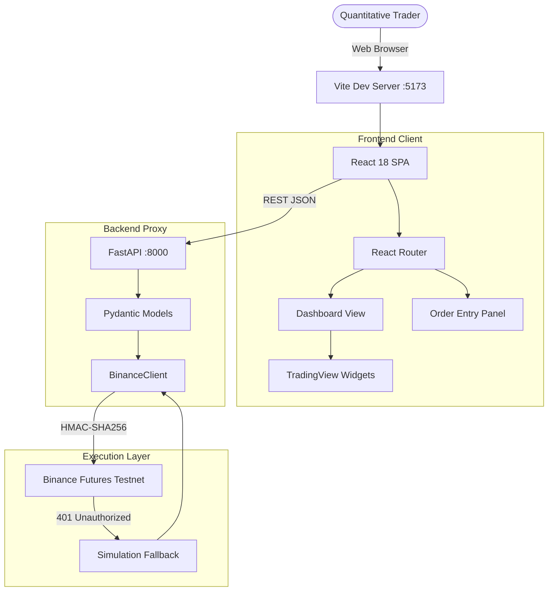

# TradeFlow Web Architecture

The WebApp branch contains a fully decoupled frontend/backend architecture designed for latency optimization and UI responsiveness.

## System Diagram

## Component Hierarchy

- `App.tsx`: Context Providers (Theme, Settings) and Router.
- `Dashboard.tsx`: Primary view containing charts and real-time logs.
- `Layout.tsx`: Glassmorphic navigation shell.
- `api.py`: Python FastAPI execution environment bridging the UI and Binance.
