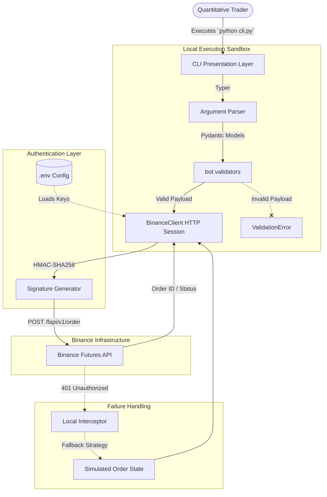
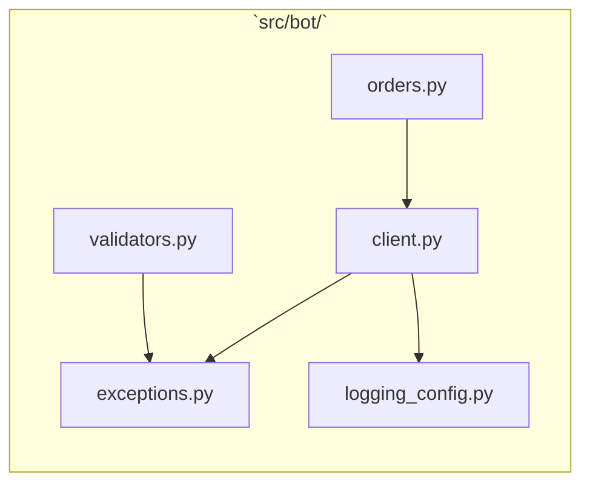

# Architecture & Data Flow

TradeFlow CLI relies on a direct, secure connection between the local executing machine and the Binance matching engine, eliminating any intermediary latency.

## System Architecture

## Internal Component Diagram

