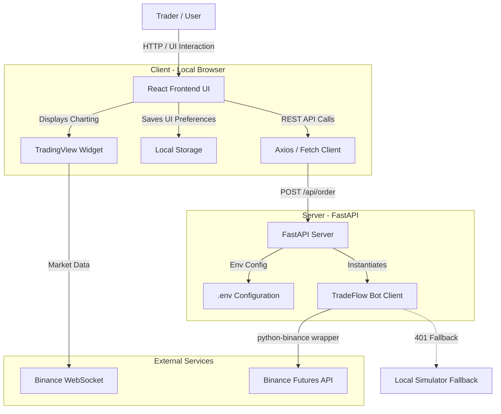

# TradeFlow Architecture

This document outlines the high-level system architecture and data flow for the TradeFlow Algorithmic Terminal.

## High-Level System Design

TradeFlow utilizes a decoupled client-server architecture to ensure security (API keys remain server-side) and performance (trading logic runs headless, untouched by UI rendering constraints).

## Data Flow: Placing an Order

1. **User Action**: The user configures order parameters (Symbol, Side, Type, Quantity) in the React UI (`NewOrder.tsx`).
2. **REST Request**: The frontend fires a POST request to the local FastAPI server (`http://127.0.0.1:8000/api/order`).
3. **Validation**: FastAPI parses and validates the payload using Pydantic models.
4. **Execution**: The `BinanceClient` (`bot/client.py`) constructs the secure API request using the loaded `.env` credentials and transmits it to Binance.
5. **Response Handling**: 
   - *Success*: Binance returns the executed order ID and state, which propagates back to the UI.
   - *Failure (401)*: The API intercepts the failure and routes to the **Simulation Fallback**, generating a mock order ID so UI testing is uninterrupted.
